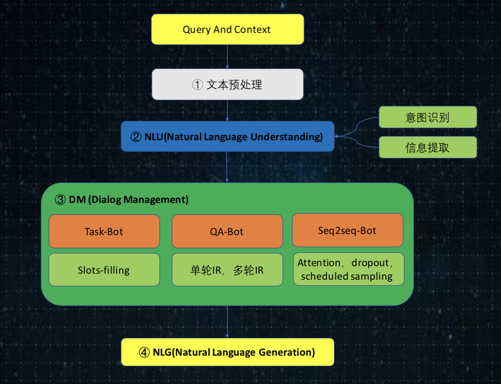

# JDDC 大赛解决方案

[大赛网址](http://jddc.jd.com/)

成绩：并列亚军，成绩排名第三，有问题联系邮箱：huanghailong17@mails.ucas.ac.cn

## 方案框架

初赛使用检索匹配模型，决赛使用生成模型，人工评估使用综合对话框架。涉及到京东比赛数据隐私问题，这里只提供代码，大家可以参考，限于水平，请多在issue中提出改进建议。



## 代码运行

> 数据较大400M，github容量限制，完整的模型代码传到百度云上，下载即可运行，[下载链接](https://pan.baidu.com/s/1NPYLJ04jE5i50LYLVvCRBQ)。

### Step 1. 处理数据
京东官方比赛的数据没有公开，这里使用了18年公开的一份[淘宝客服对话数据](https://github.com/cooelf/DeepUtteranceAggregation)。在目录E-commerce下，运行process.sh。

### Step 2. 训练seq2seq模型
在目录seq2seq_dialog下，训练单轮对话模型： `./single_turn_train.sh`，训练多轮对话模型：`./multi_turn_train.sh`

### Step 3. 运行对话程序
在根目录下，运行`python dialog_manage.py`，即可运行对话系统程序。

运行示例：(注意seq2seq模型未训练，所以给出了一堆不知所以的回复，大家训练下seq2seq模型哦，不能偷懒)
```
Chatbot: 您好，我是可爱的人工智能机器人小智，有问题都可以向我提问哦~

input1: 你好，我的快递怎么还没到呢
[DEBUG] intent=general, task_response=None
[DEBUG] init_query=你好我的快递怎么还没到呢, filter_query=你好我的快递怎么还没到呢
[DEBUG] qa_search_sim_doc=怎么还没到呢, score=19.1494
[DEBUG] seq2seq_input=你好，我的快递怎么还没到呢
[DEBUG] search_response=稍等哦我查下您补发宝贝的物流信息客官今天给您派送哦请保持电话通畅方便快递方面联系您哦
[DEBUG] seq2seq_response=在
output1: 稍等哦我查下您补发宝贝的物流信息客官今天给您派送哦请保持电话通畅方便快递方面联系您哦

input2: 怎么开发票呢
[DEBUG] intent=invoice, task_response=您好，您在提交订单页面发票类型中选择好发票信息，有电子发票(增值税普通发票)、增值税专用发票供您选择
[DEBUG] init_query=怎么开发票呢, filter_query=怎么开发票呢
[DEBUG] qa_search_sim_doc=你家每次开发票怎么就那么费劲, score=9.9780
[DEBUG] seq2seq_input=你好，我的快递怎么还没到呢 怎么开发票呢
[DEBUG] search_response=我查下哦
[DEBUG] seq2seq_response=在在在的哦在的哦在的哦在的哦在的哦在的哦在的哦在的哦在的哦在的哦在的哦在的哦在的哦在的哦在的哦在一份
output2: 您好，您在提交订单页面发票类型中选择好发票信息，有电子发票(增值税普通发票)、增值税专用发票供您选择
```
